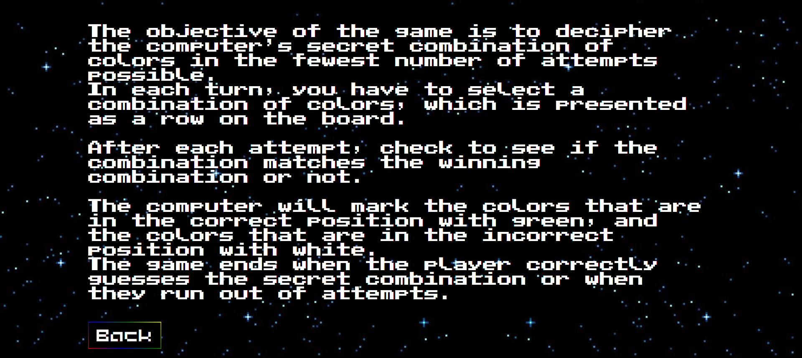
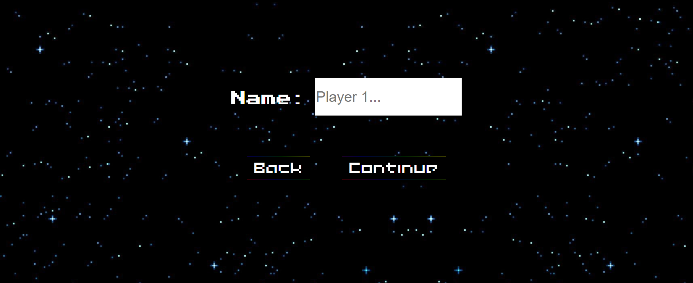
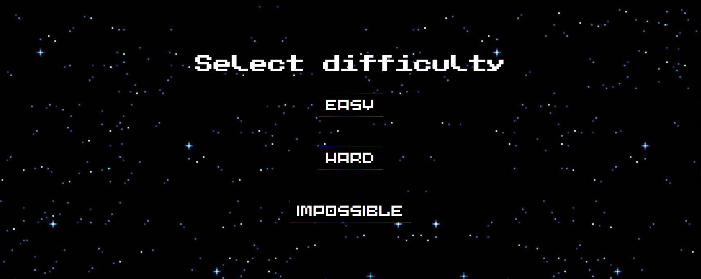
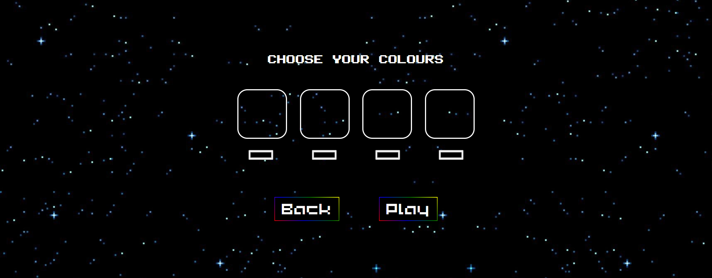
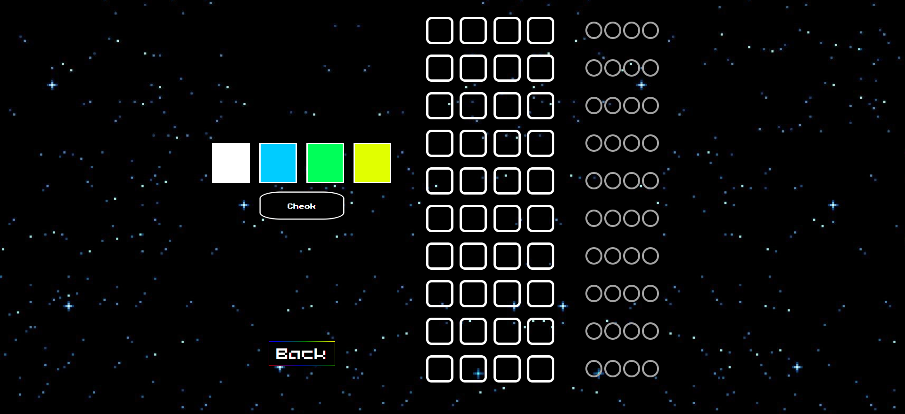

<link href="https://fonts.cdnfonts.com/css/Public-pixel" rel="stylesheet">

_______________________________________________________________

<h1 style="text-align: center; font-family:'Public pixel'; background-image: linear-gradient(45deg, green, blue, red); -webkit-background-clip: text; color: transparent; font-size: 2em;">♠️ <u>MASTERMIND</u> ♠️</h1>

_______________________________________________________________

[pabloprost.github.io/Mastermind/](pabloprost.github.io/Mastermind/) < Ir al proyecto (MASTERMIND).
[https://github.com/PabloProst?tab=repositories](https://github.com/PabloProst?tab=repositories) < Ir a mis repositorios.

<h4>Este proyecto fue realizado por Pablo Ezequiel Prost, alumno del Bootcamp Full Stack Developer de Valencia, 2023.</h4>

#####El Mastermind es un juego clásico para un jugador que consiste en descubrir la combinación secreta de colores oculto creada a partir de los colores elegidos por el jugador.
 

_______________________________________________________________

<h1 style="text-align: center; font-family:'Public pixel'; background-image: linear-gradient(45deg, red, blue, purple); -webkit-background-clip: text; color: transparent; font-size: 1.5em;">♠️ <u>ABOUT</u> ♠️</h1>

#####↠ Esta sección explica el cómo jugar, cómo leer las comprobaciones y cuándo se termina el juego.
 

_______________________________________________________________

<h1 style="text-align: center; font-family:'Public pixel'; background-image: linear-gradient(45deg, red, blue, purple); -webkit-background-clip: text; color: transparent; font-size: 1.5em;">♠️ <u>NICKNAME</u> ♠️</h1>

#####↠ Escoge tu nombre de usuario para ser mostrado en la pantalla final junto al resultado de cada partida jugada.
 

_______________________________________________________________

<h1 style="text-align: center; font-family:'Public pixel'; background-image: linear-gradient(45deg, red, blue, purple); -webkit-background-clip: text; color: transparent; font-size: 1.5em;">♠️ <u>DIFFICULTY</u> ♠️</h1>

#####↠ Aquí el juego te permite seleccionar la dificultad de la partida, una vez terminada la misma, se te volverá a pedir que escojas la dificultad de tu próximo juego.
 

_______________________________________________________________

<h1 style="text-align: center; font-family:'Public pixel'; background-image: linear-gradient(45deg, red, blue, purple); -webkit-background-clip: text; color: transparent; font-size: 1.5em;">♠️ <u>COLOUR SELECTION</u> ♠️</h1>

#####↠ Elige tus cuatro colores para poder comenzar una partida, estos serán los colores que te permetirán colorear las casillas del tablero. No puedes dejar ningún color vacío ni puedes repetir 2 o más colores.
 

_______________________________________________________________

<h1 style="text-align: center; font-family:'Public pixel'; background-image: linear-gradient(45deg, red, blue, purple); -webkit-background-clip: text; color: transparent; font-size: 1.5em;">♠️ <u>IN GAME</u> ♠️</h1>

#####↠ Una vez realizados los pasos anteriores, podemos empezar a jugar.
 

_______________________________________________________________

<h1 style="text-align: center; font-family:'Public pixel'; background-image: linear-gradient(45deg, red, blue, purple); -webkit-background-clip: text; color: transparent; font-size: 1.2em;">♠️ <u>SKILLS</u> ♠️</h1>

{width=50% style="margin-left:200px"}
