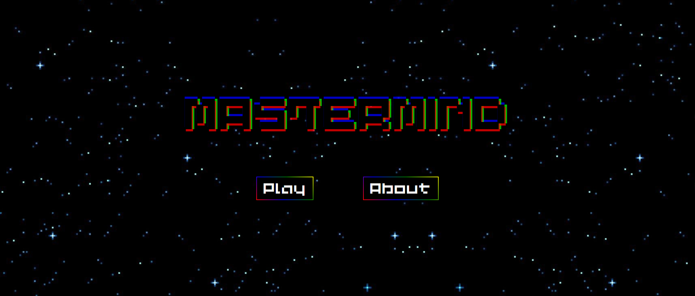

<link href="https://fonts.cdnfonts.com/css/Public-pixel" rel="stylesheet">

_______________________________________________________________

<h1 style="text-align: center; font-family:'Public pixel'; background-image: linear-gradient(45deg, green, blue, red); -webkit-background-clip: text; color: transparent; font-size: 2em;">♠️ <u>MASTERMIND</u> ♠️</h1>

_______________________________________________________________

<h4>Este proyecto fue realizado por Pablo Ezequiel Prost, alumno del Bootcamp Full Stack Developer de Valencia, 2023.</h4>

#####El Mastermind es un juego clásico para un jugador que consiste en descubrir la combinación secreta de colores oculto creada a partir de los colores elegidos por el jugador.

